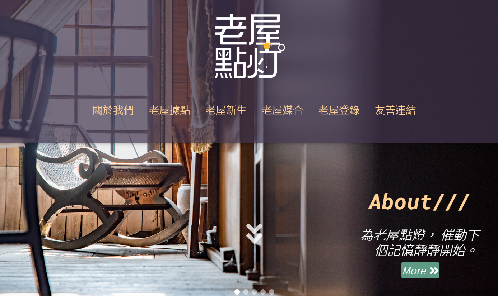

## 專題製作 | 彰化老屋點燈媒合平台 
資料來源：彰化縣文化局、未來地圖有限公司（承辦老屋點燈手冊製作計畫） 
[DEMO](https://vina2325.github.io/LightUpOldHouse/#/ "Title") 
  
### 專題發想
這是源自於彰化縣政府文化局，從2017年至2019年的歷史老屋活化再利用補助計畫，因工作緣故我有幸參與到2019年的老屋點燈手冊編排設計，藉此想透過專題練習的機會，將原先平面化的紙本手冊轉化為數位化的互動性網站，同時也能順道與大家分享彰化的美好。  

老屋修繕與維護是一條漫長的路，每個街區、每間老屋也建構出獨特的地方空間敘事，彰化縣府透過歷史老屋活化再利用補助計畫，重新思考老屋與地方的關係，凝聚了在地文化保存發展的意識，期待藉由公私協力合作，以老屋空間作為時代記憶與文化傳承的重要載體，並將歷史老屋帶入地方的文化經濟循環，讓城鄉空間與人的故事可以傳遞述說。  

本平台主要提供老屋屋主及想要經營老屋空間之民眾或單位，一個良好的交流平台，以及建置本縣歷史老屋活化再利用補助的各項申請資訊和歷史老屋活化的案例與故事，期盼在老屋供、需資訊的交流與公、私部門通力合作下，能吸引更多民眾投入老屋振興工作，並透過老屋的故事來認識彰化。 
### 網站規劃
<ol>
<li>首頁採取單頁式網站(Single-Page)的架構，目的希望使用者一進網站就能一目了然所有的功能，並可視個人需求由「看更多」的方式進到個別的分頁。</li>
<li>網站中特別規劃將手冊原先設計的地圖，改以SVG圖檔方式引入，突破地圖本身在平面設計上的限制，以互動式地圖的模式提升網站視覺上的感官，增強使用者體驗。</li>
<li>整體網站皆採用RWD響應式網頁設計，讓使用者在各尺寸的螢幕平台閱覽上，都能有良好的操作體驗。</li>
<li>網站設有註冊與登入的功能，並能將資料傳到後台的資料庫。</li>
</ol>
 

### 網頁設計樣式
配色上採用紫、黃、橘、綠為網站的主要色系，營造復古懷舊的氛圍；LOGO方面，因早有現成的設計，因而只有微縮字體的筆劃寬度，好符合小螢幕上能夠清楚呈現。
